# **Traffic Sign Recognition** 

## Writeup

### Data Set Summary & Exploration

I used the numpy library to calculate summary statistics of the traffic signs data set:

* The size of training set is 34799
* The size of the validation set is 4410
* The size of test set is 12630
* The shape of a traffic sign image is (32, 32, 3)
* The number of unique classes/labels in the data set is 43

#### 2. Include an exploratory visualization of the dataset.

First I investigated how many instances of different sign types are in training set. Model will probably
bias classifying uncertain instances as signs that have more instances in training set. Also sign types with
less instances will probably have worse performance.

This was the result:

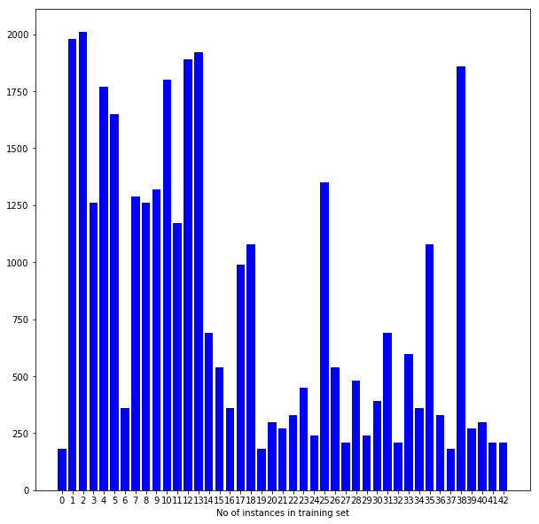

This clearly shows that there are a lot of variability and some sign types don't have enough instances and it would
be good to generate additional instances.

To have better understanding of different sign types, I plotted random instance from each sign type:

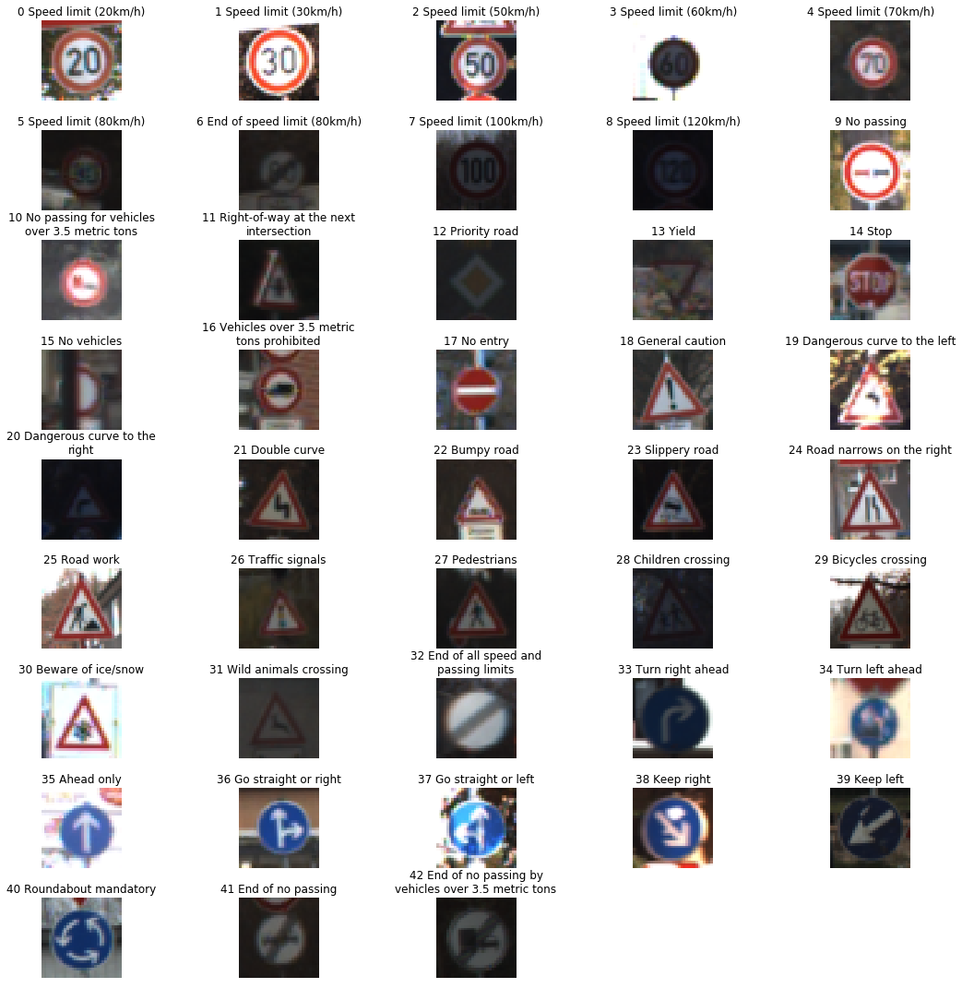

We can notice following things from these samples:
* Image resolution is low and some signs are hard to classify even for human
* Some sign types are very similar, so model will probably struggle to predict these:
    * red triangle with black specifics in middle, for ex. 23, 24, 27, 28
    * red circle with specifics in middle, for ex. 0, 1, 2, 4, 9, ...
    * some images have bad lighting conditions

### Design and Test a Model Architecture

#### 1. Describe how you preprocessed the image data. What techniques were chosen and why did you choose these techniques? Consider including images showing the output of each preprocessing technique. Pre-processing refers to techniques such as converting to grayscale, normalization, etc. (OPTIONAL: As described in the "Stand Out Suggestions" part of the rubric, if you generated additional data for training, describe why you decided to generate additional data, how you generated the data, and provide example images of the additional data. Then describe the characteristics of the augmented training set like number of images in the set, number of images for each class, etc.)

##### Data augmentation
 
Data was augmented by generating new images by translating, rotating and shearing existing images. Some examples of generated instances:

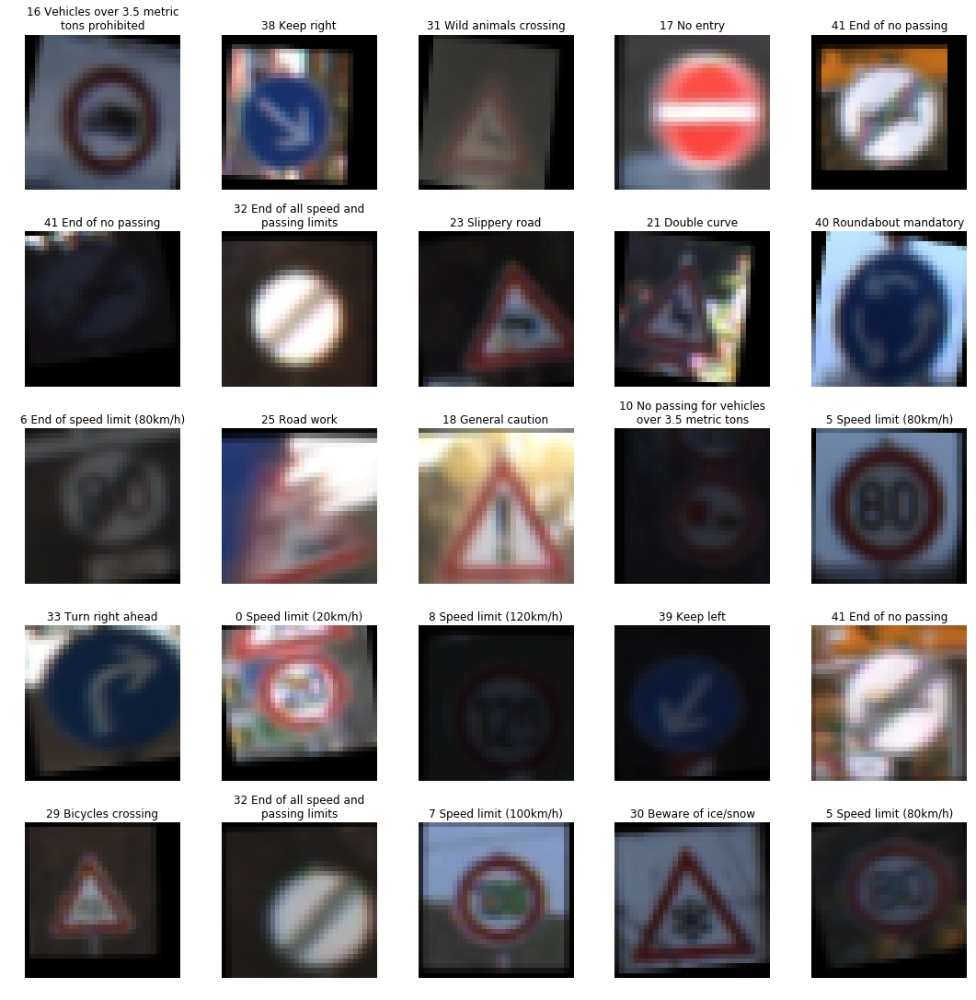


3000 new instances were created for every sign type, this gave more uniform distribution of instances:
 
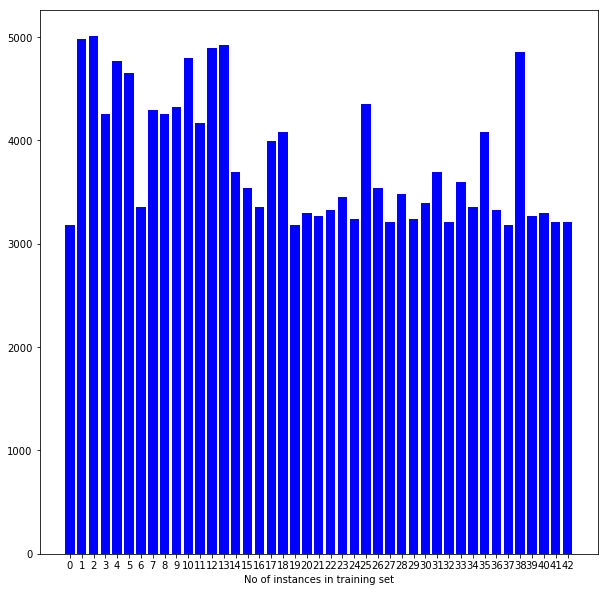

##### Grayscale

Images were converted to grayscale using OpenCV library. Some samples of grayscale images:

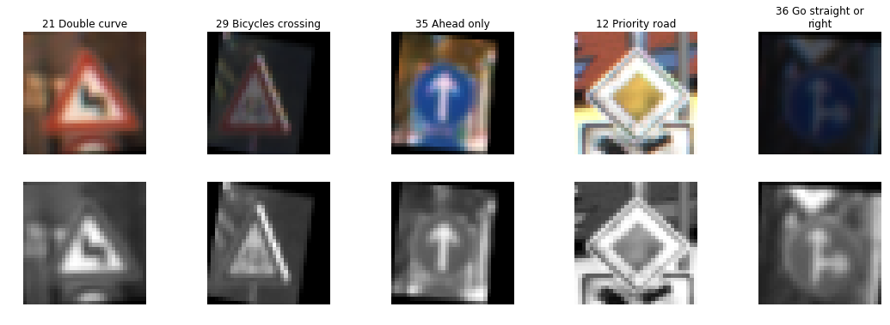

##### Normalization

All training, validation and testing image data was normalized by 2 ways:
* **Centering**: data was centered around mean 0, which improves vanishing/exploding gradients and also increased convergence
* **Scaling**: Image data was scaled down by dividing with 1 standard deviation, which helps convergence speed and accuracy

```python
X_train = (X_train - X_mean) / X_std
```


#### 2. Describe what your final model architecture looks like including model type, layers, layer sizes, connectivity, etc.) Consider including a diagram and/or table describing the final model.

My final model consisted of the following layers:

| Layer         		|     Description	        					| 
|:---------------------:|:---------------------------------------------:| 
| Input         		| 32x32x3 RGB image   							| 
| Convolution 3x3     	| 1x1 stride, same padding, outputs 32x32x64 	|
| RELU					|												|
| Max pooling	      	| 2x2 stride,  outputs 16x16x64 				|
| Convolution 3x3	    | etc.      									|
| Fully connected		| etc.        									|
| Softmax				| etc.        									|
|						|												|
|						|												|
 


#### 3. Describe how you trained your model. The discussion can include the type of optimizer, the batch size, number of epochs and any hyperparameters such as learning rate.

To train the model, I used an ....

#### 4. Describe the approach taken for finding a solution and getting the validation set accuracy to be at least 0.93. Include in the discussion the results on the training, validation and test sets and where in the code these were calculated. Your approach may have been an iterative process, in which case, outline the steps you took to get to the final solution and why you chose those steps. Perhaps your solution involved an already well known implementation or architecture. In this case, discuss why you think the architecture is suitable for the current problem.

I used iterative approach by changing one aspect of neural net architecture and then testing change with re-training network and measuring performance with validation set.

##### 1. First version, LeNet
First architecture was just LeNet from previous lab. Image data was not preprocessed, no grayscaling or normalisation was done. This gave baseline performance that was used that future changes to preprocessing and model actually improved performance.

10 epochs were used to train the model.

Validation set accuracy: **87.3%**

##### 2. Normalization

First change to pipeline was adding normalization.

20 epochs were used. At first I tried with 10 epoch, but because validation accuracy kept improving, I increased epochs to 20.

Validation set accuracy: **92.7%**

##### 3. Grayscale

Improved data pipeline adding image conversion to grayscale. This didn't change accuracy.

Validation set accuracy: **92.4%**

##### 4. Dropout

To avoid overfitting, dropout with keep probability 0.5 was added to dense (fully connected) layers. Dropout was not added to convolutional layers as weights are shared between spatial positions so there shouldn't be huge number of parameters to overfit.

Validation set accuracy: **95.1%**

##### 5. Additional layers

Added new convolutional and dense layers, but this didn't improve performance.

Validation set accuracy: **95.2%**

##### 6. L2 regularization

Added L2 regularization to all layers, this should reduce overfitting. 

Tried with different beta values, but settled to 0.001.

Validation set accuracy: **96.2%**

##### 7. Data augmentation

Added data augmentation to data pipeline by generating 3000 new images to every sign type by rotating, translating, shearing existing samples.

As these images were generated in data pipeline and not while training, I was limited to memory available. As this didn't improve performance , I didn't look into improving this.
 
Validations set accuracy: **95.6%**


##### 8. More filters

As model seems to have stagnated, I suspected that I need to have more parameters, so increased filter count in convolutional layers to 64. Tried different values like 32, but 64 gave best performance.

Validation set accuracy: **98.1%**

##### 9. Test set accuaracy

As I had good enough validation set accuracy, it was time to test model with test data set.

Test set accuracy: **95.2%**

I also looked into how accurately model predicted each sign type:

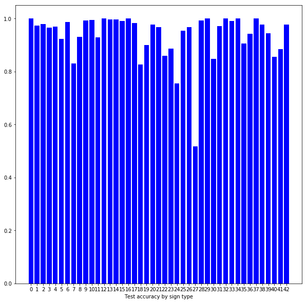

5 sign types with lowest accuracy:

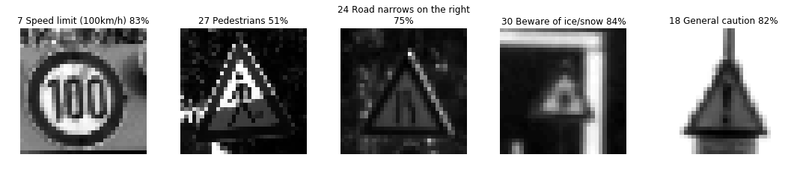

It easy to see that all signs with low accuracy are red square/traingle with some specifics in middle, so model is having hard time distinguishing between these signs. This is what we predicted in data exploration and seems logical as images have quite low resolution. Improving networks this aspect would increase prediction accuracy.

### Test a Model on New Images

#### 1. Choose five German traffic signs found on the web and provide them in the report. For each image, discuss what quality or qualities might be difficult to classify.

I took 6 different sign types using Google Maps Street View from Berlin streets:

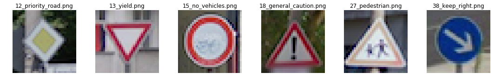

#### 2. Discuss the model's predictions on these new traffic signs and compare the results to predicting on the test set. At a minimum, discuss what the predictions were, the accuracy on these new predictions, and compare the accuracy to the accuracy on the test set (OPTIONAL: Discuss the results in more detail as described in the "Stand Out Suggestions" part of the rubric).

Here are the results of the prediction:

| Image			        |     Prediction	        					| 
|:---------------------:|:---------------------------------------------:| 
| Priority road    		| Priority road									| 
| Yield       			| Yield 										|
| No vehicles			| No vehicles									|
| General caution  		| General caution				 				|
| Pedestrian    		| Children crossing    							|
| Keep right 		    | Keep right          							|


The model was able to correctly guess 5 of the 6 traffic signs, which gives an accuracy of **83.3%**. Only sign that was predicted wrong is *Pedestrian*, but this seems fair mistake as this sign is very similar to *Children crossing* sign. That is also similar problem we already noticed in data exploration and model testing stage.

#### 3. Describe how certain the model is when predicting on each of the five new images by looking at the softmax probabilities for each prediction. Provide the top 5 softmax probabilities for each image along with the sign type of each probability. (OPTIONAL: as described in the "Stand Out Suggestions" part of the rubric, visualizations can also be provided such as bar charts)

For incorrectly predicted sign, these were probabilities:

| Probability         	|     Prediction	        					| 
|:---------------------:|:---------------------------------------------:| 
| .660         			| Right-of-way at the next intersection			| 
| .202     				| Beware of ice/snow 							|
| .126					| Children crossing								|
| **.011**     			| **Pedestrians**				 				|
| .000				    | Road work      							    |

Correct sign class *Pedestrians* had only .011 probability.

For other signs, model predicted with 1.000 certainty correct sign, all others signs got .000

This is because *logits* output is quite big numbers (some negative). For ex.:

```
[-50.615 -9.279 -6.437 -24.246 -23.738 -22.907 -34.755 -13.501 -41.476
 -35.656 -33.362 -8.740 36.969 -13.907 -28.858 -35.761 -45.814 -35.312
 -29.130 -53.413 -51.317 -36.521 -56.519 -55.871 -82.689 -21.270 -47.960
 -62.535 -27.741 -56.364 -31.267 -70.155 -14.200 -24.300 -14.641 -8.276
 -32.469 -21.779 8.023 -8.866 14.699 -13.673 -19.075]
```

As softmax is explonential function, this translates into one class getting *1.000* probability and every other class *.000*:
```
[0.000 0.000 0.000 0.000 0.000 0.000 0.000 0.000 0.000 0.000 0.000 0.000
 1.000 0.000 0.000 0.000 0.000 0.000 0.000 0.000 0.000 0.000 0.000 0.000
 0.000 0.000 0.000 0.000 0.000 0.000 0.000 0.000 0.000 0.000 0.000 0.000
 0.000 0.000 0.000 0.000 0.000 0.000 0.000]]
```

### Visualizing the Neural Network (See Step 4 of the Ipython notebook for more details)

I used following image to visualize feature maps:

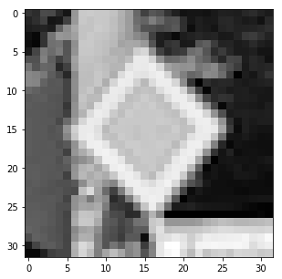

Output of **first layer**:

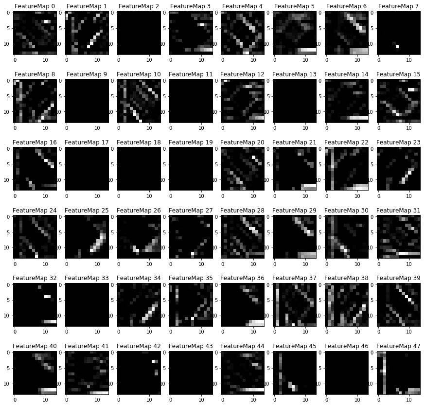

First layer outputs general lines from image.

Some of the filter seems to output nothing, I think this indicates:
* *Too many filter* - but when decreasing filter count from 64 to 32, model accuracy dropped
* *Too few epochs* - but prediction accuracy has stabilized with 20 epochs and doesn't seem to improve when increasing to 30

So not really sure how to improve this.

Output of **second layer**:

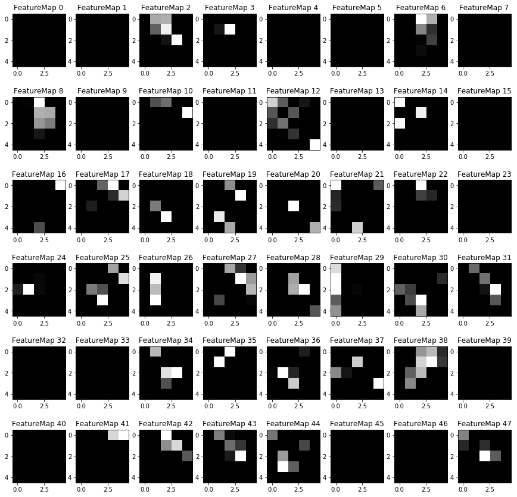

Second layer outputs where different features are spatially found on image.

